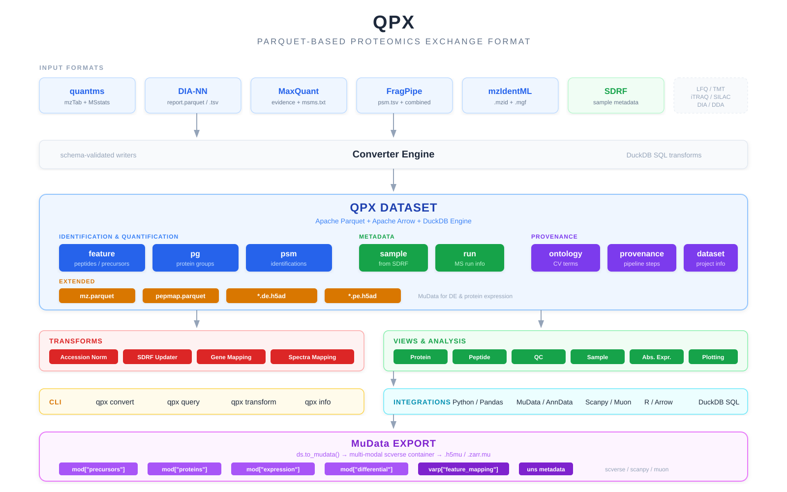
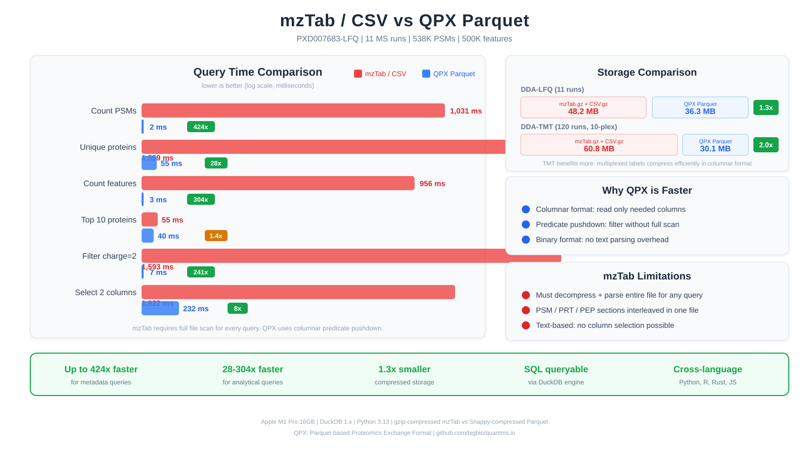

# QPX

A standardized format and toolkit for mass spectrometry proteomics data

---

## What is QPX?

QPX is a comprehensive ecosystem for proteomics data that provides:

- **Standardized Data Format**: Parquet-based format for efficient storage and processing of proteomics data
- **Universal Converter**: Convert data from MaxQuant, DIA-NN, Spectronaut, FragPipe, quantms, CPTAC CDAP, mzIdentML, and more
- **Complete Toolkit**: Process, analyze, visualize, and share your proteomics results
- **Python API & CLI**: Flexible tools for both programmatic and command-line usage

---

## Architecture Overview

QPX provides a comprehensive proteomics data processing architecture with core modules for data conversion, transformation, visualization, statistical analysis, and project management.

### Performance

---

## Supported Input Formats

| Software        | PSM              | Feature              | Protein Group            |
| --------------- | ---------------- | -------------------- | ------------------------ |
| **MaxQuant**    | msms.txt         | evidence.txt         | proteinGroups.txt        |
| **DIA-NN**      | -                | report.tsv           | pg_matrix.tsv            |
| **Spectronaut** | -                | report.tsv           | report.tsv (PG.Quantity) |
| **FragPipe**    | psm.tsv          | combined_peptide.tsv | combined_protein.tsv     |
| **quantms**     | mzTab PSM section| mzTab + MSstats      | mzTab PRT section        |
| **CPTAC CDAP**  | .psm             | .psm reporter ions   | feature-derived          |
| **mzIdentML**   | .mzid / .mzid.gz | -                    | -                        |
| **SDRF**        | -                | -                    | - (sample + run)         |

All conversions produce standardized Parquet and AnnData files following the [QPX specification](spec/index.md).

---

## Documentation

| Section                                             | Description                                     |
| --------------------------------------------------- | ----------------------------------------------- |
| **[Quick Start](quickstart.md)**                    | Installation and basic usage                    |
| **[Format Specification](spec/index.md)**           | Data format schemas and specifications          |
| **[User Guide](guide/index.md)**                    | CLI reference and command documentation         |
| **[Examples & Tutorials](examples/index.md)**       | Usage examples and integrations                 |
| **[Troubleshooting](troubleshooting.md)**           | Common issues and solutions                     |
| **[Community & Support](community.md)**             | Get help, contribute, license & acknowledgments |

---

**Ready to get started?** Install qpx and [check out the examples](examples/index.md)!
