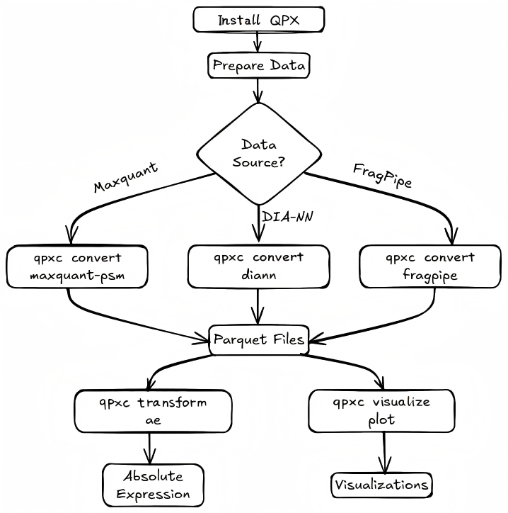

# Quick Start

Get started with qpx in minutes - from installation to your first data conversion.

## Quick Start Flow



## Prerequisites

Before installing qpx, ensure you have:

- **Python 3.10 or higher** - Check with `python --version`
- **pip** - Python package manager (included with Python)
- **Optional**: conda/mamba for environment management

## Installation

=== "pip (Recommended)"

    ```bash
    pip install qpx
    ```

=== "conda"

    ```bash
    # Create a new environment
    conda create -n qpx python=3.10
    conda activate qpx

    # Install qpx
    pip install qpx
    ```

=== "From Source"

    ```bash
    git clone https://github.com/bigbio/qpx.git
    cd qpx
    pip install .
    ```

## Verify Installation

After installation, verify qpx is working correctly:

```bash
# Check version
qpxc --version

# View available commands
qpxc --help
```

You should see output similar to:

```text
Usage: qpxc [OPTIONS] COMMAND [ARGS]...

  qpxc -- quantitative proteomics data format tools.

Options:
  --version   Show the version and exit.
  -h, --help  Show this message and exit.

Commands:
  convert    Convert external tool outputs to QPX format.
  info       Show information about a QPX dataset.
  ontology   Manage CV ontology data (PSI-MS, PRIDE CV).
  query      Query and inspect QPX datasets.
  transform  Transform QPX data into derived representations.
  validate   Validate a QPX dataset or structure against the canonical...
```

## Your First Conversion

Let's convert some sample MaxQuant data to QPX format.

### Step 1: Download Sample Data

```bash
# Create a working directory
mkdir qpx-tutorial && cd qpx-tutorial

# Download sample MaxQuant msms.txt file
curl -L -o msms.txt \
  "https://raw.githubusercontent.com/bigbio/qpx/main/tests/examples/maxquant/maxquant_simple/msms.txt"
```

### Step 2: Convert to QPX Format

```bash
# Convert MaxQuant PSM data to QPX parquet format
qpxc convert maxquant \
    --msms-file msms.txt \
    --output-folder ./output \
    --structures psm \
    --verbose
```

### Step 3: Verify the Output

```bash
# List the generated files
ls -la output/

# You should see a file like: psm-{uuid}.psm.parquet
```

### Step 4: Inspect the Data (Optional)

```python
# Using Python to read the parquet file
import pyarrow.parquet as pq

table = pq.read_table("output/psm-*.psm.parquet")
df = table.to_pandas()

print(f"Total PSMs: {len(df)}")
print(f"Columns: {list(df.columns)}")
print(df.head())
```

## What's Next?

Now that you've completed your first conversion, explore more:

| Next Step                                       | Description                           |
| ----------------------------------------------- | ------------------------------------- |
| [Examples Overview](examples/index.md)       | More conversion and analysis examples |
| [Convert Commands](guide/convert.md)              | All available data converters         |
| [Transform Commands](guide/transform.md)          | Data transformation tools             |
| [Format Specification](spec/index.md) | Understanding QPX data formats        |

## Common Commands

```bash
# Convert DIA-NN data
qpxc convert diann --report-path report.tsv --sdrf-file data.sdrf.tsv --output-folder ./output

# Convert FragPipe data
qpxc convert fragpipe --psm-file psm.tsv --output-folder ./output

# Validate a QPX dataset
qpxc validate --dataset-folder ./output

# Query a QPX dataset
qpxc query --dataset-folder ./output --sql "SELECT * FROM psm LIMIT 10"
```

## Need Help?

- Run `qpxc <command> --help` for detailed command help
- Check the [Troubleshooting](troubleshooting.md) guide
- Visit our [GitHub Issues](https://github.com/bigbio/qpx/issues) for support
