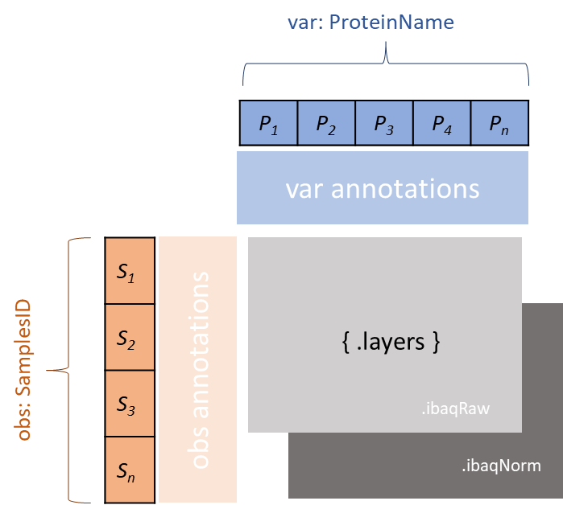

# AnnData Concepts

QPX uses [AnnData](https://anndata.readthedocs.io/) (`.h5ad`) as the primary format for expression views -- both [Absolute Expression](absolute.md) and [Differential Expression](differential.md). This page describes the general AnnData conventions shared across expression views.

## Why AnnData?

AnnData is the standard interchange format for the [scverse](https://scverse.org/) ecosystem (scanpy, scvi-tools, muon). It provides:

- **Matrix-form representation** (samples x proteins) natural for expression data
- **Multi-layer storage** for alternative quantifications (raw, normalized, log-transformed)
- **Structured metadata** for samples (`obs`), proteins (`var`), and unstructured data (`uns`)
- **HDF5 backend** for efficient storage and partial reads
- **Ecosystem interop** with scanpy plotting, scvi-tools, muon multi-omics, and Lamin.ai

## AnnData structure overview

```
AnnData
  X            (n_obs x n_vars)    Primary data matrix
  obs          (n_obs x ...)       Observation (sample) metadata
  var          (n_vars x ...)      Variable (protein) metadata
  layers       (n_obs x n_vars)    Alternative quantification matrices
  uns          (dict)              Unstructured metadata (DE results, file metadata)
  obsm/varm    (optional)          Embeddings and dimensionality reductions
```



## Conventions

### obs index = sample accession

The `obs` index uses sample accessions from the SDRF. Sample-level metadata (organism, tissue, disease, replicate info) is stored as columns in `obs`.

### var index = protein accession

The `var` index uses UniProt protein accessions. Protein-level metadata (gene names) is stored as columns in `var`.

### X = primary quantification

The primary quantification matrix occupies `X`. For absolute expression, this is `ibaq_log`. The choice of log-transformed values as the primary matrix follows the scRNA-seq convention where `X` holds log-normalized counts.

### layers = alternative quantifications

Additional quantification types are stored as AnnData layers. Each layer has the same dimensions as `X` (samples x proteins).

### uns = file metadata + DE results

File-level metadata (QPX version, project accession, creation date) and differential expression results are stored in `uns`.

## File naming

Expression AnnData files follow the QPX naming convention:

| View | Extension | Example |
|------|-----------|---------|
| Absolute Expression | `.ae.h5ad` | `PXD000000.ae.h5ad` |
| Differential Expression | `.de.h5ad` | `PXD000000.de.h5ad` |

## Reading and writing

### Reading

```python
import anndata as ad

# Read AE data
adata = ad.read_h5ad("PXD000000.ae.h5ad")
print(adata)
# AnnData object with n_obs x n_vars = 120 x 5432
#     obs: 'organism', 'organism_part', 'disease', ...
#     var: 'gene_name'
#     layers: 'ibaq_raw', 'ibaq_ppb', 'copies_per_cell', 'concentration_nm'
```

### Writing

```python
adata.write("PXD000000.ae.h5ad")
```

### Using the QPX library API (proposed)

```python
# AE
ae = project.ae()
adata = ae.to_anndata(x_column="ibaq_log")

# DE
de = project.de()
adata.uns["de_results"] = de.to_de_results()

# Save combined
adata.write("PXD000000.ae.h5ad")
```

## Missing values

When a protein is not detected in a sample, the corresponding cell in `X` and `layers` contains `NaN`. This is consistent with how scRNA-seq handles dropout events and is the standard behavior when pivoting from long-form to matrix-form.

## Multi-omics integration

AnnData enables integration of proteomics data with other omics modalities:

- **CITE-seq + bulk proteomics**: Concatenate protein-level AnnData objects from different technologies.
- **muon**: Use `muon.MuData` to combine proteomics and transcriptomics AnnData objects.
- **Lamin.ai**: Register QPX AnnData output as a Lamin Artifact with schema validation and ontology-backed labels.

## Further reading

- [Absolute Expression](absolute.md) -- AE-specific AnnData schema and examples
- [Differential Expression](differential.md) -- DE-specific AnnData schema and examples
- [AnnData documentation](https://anndata.readthedocs.io/) -- Official AnnData reference
- [scanpy](https://scanpy.readthedocs.io/) -- Analysis framework for AnnData
