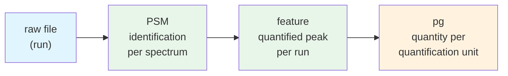
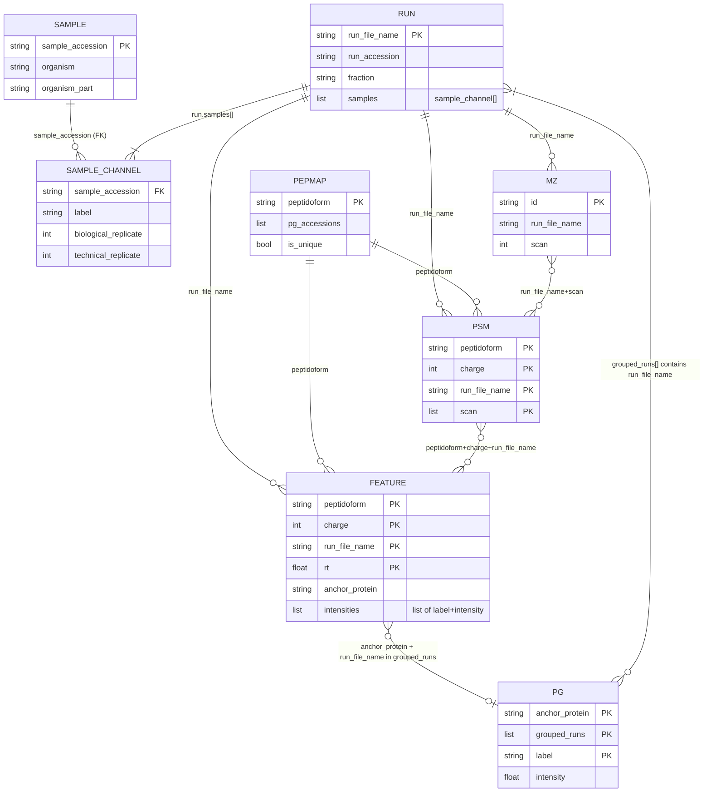
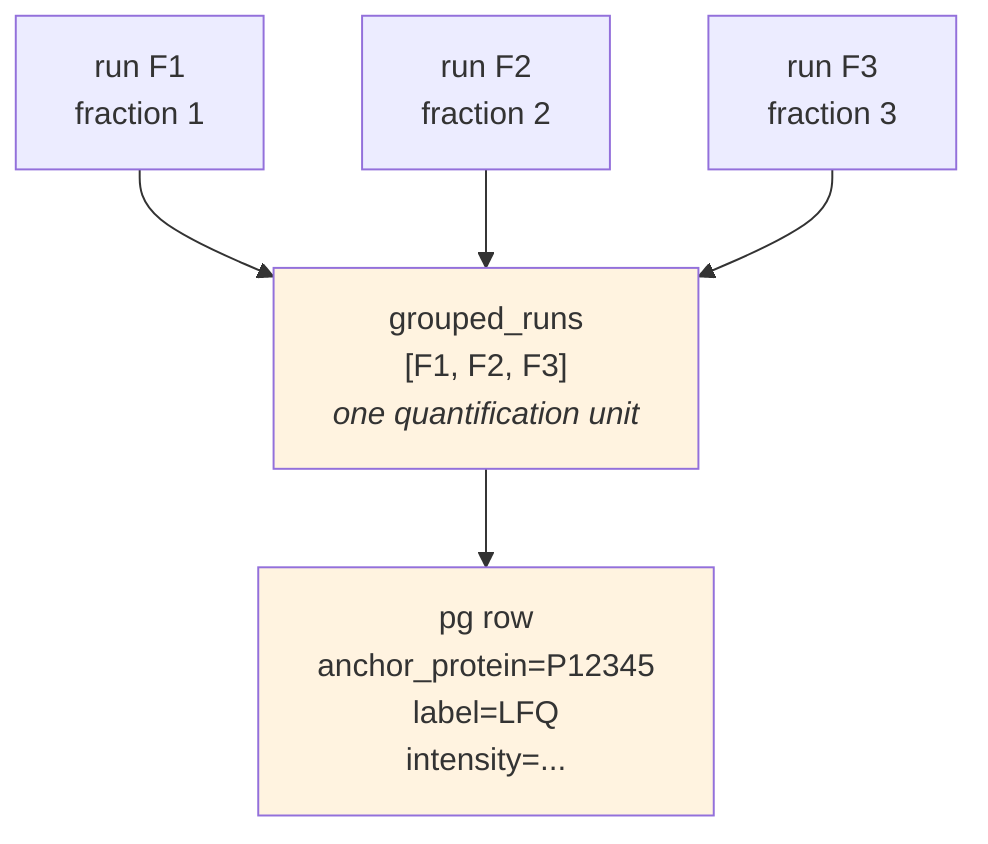
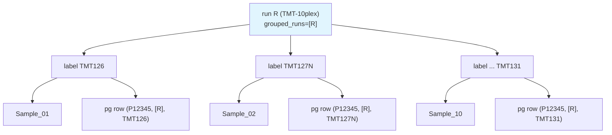
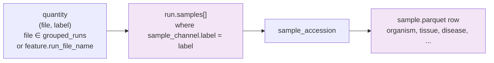

# QPX Data Model

This page is the **conceptual map** of QPX. It defines every core term once, shows
how the views relate through explicit join keys, and traces how a single
measurement flows from a raw file to a protein-group quantity. Read it before the
individual view pages — those give field-by-field detail, this gives the shape of
the whole.

!!! abstract "Why this page exists"
    The relationships between channels, labels, `grouped_runs`, fractions, protein
    groups, features, and samples are easy to misread, and a structural bug once
    slipped through because they were not written down clearly. Everything here is
    verifiable against the YAML schemas in `qpx/core/data/schemas/`.

## Vocabulary

Define these once; the rest of the spec uses them consistently.

| Term | Definition | Lives in |
|------|------------|----------|
| **run** | One MS acquisition — one raw file that was measured on the instrument. One row per run. | `run.parquet` (PK `run_file_name`) |
| **run_file_name** | The raw data file name **without extension** (e.g. `S1_Frontal_1`). The universal join key from the identification/quantification views back to `run`. | `run`, `feature`, `psm`, `mz` |
| **run_accession** | Unique run identifier = SDRF **assay name**. Human/design label for the run. | `run.run_accession` |
| **sample** | A biological specimen (= SDRF **source name**). One row per sample. | `sample.parquet` (PK `sample_accession`) |
| **source name** | SDRF term for the biological sample; becomes `sample_accession`. | SDRF → `sample` |
| **channel** | A physically distinguishable measurement track within one run. LFQ has one channel; TMT-10plex has ten reporter-ion channels; plexDIA has one per plex label. | concept |
| **label** | The **canonical name of a channel** (`LFQ`, `TMT126`, `iTRAQ114`, …). This is the string that ties a quantity to a sample. For LFQ there is exactly one label, `"LFQ"`. For TMT/iTRAQ/plexDIA each channel is a distinct label mapping to a distinct sample. | `run.samples[].label`, `feature.intensities[].label`, `pg.label` |
| **fraction** | A pre-fractionation slice of one sample. Fractions of one sample share the same (source, biological replicate, technical replicate) and differ **only** in `run.fraction`. Each fraction is a separate run/raw file. | `run.fraction` |
| **grouped_runs** | The **set of raw files aggregated into one quantification unit** — the fractions of one sample+channel context, aggregated together. `list<string>` of `run_file_name`. Single-element for unfractionated or DIA data. | `pg.grouped_runs` |
| **quantification unit** | The thing a protein quantity is measured *over*: one `grouped_runs` set. A protein abundance exists per quantification unit, **not** per single raw file, because a protein quantity only emerges after aggregating its peptides across the sample's fractions. | `pg` (one row per `(anchor_protein, grouped_runs, label)`) |
| **peptidoform** | Peptide sequence + modifications in ProForma notation. The identity thread linking PSM ↔ feature ↔ pepmap. | `psm`, `feature`, `pepmap` |
| **anchor_protein** | The representative (leading) protein of a protein group. Join key from `feature` to `pg`. On `feature` it is an *annotation* (not part of feature identity); on `pg` it is part of the primary key. | `feature`, `pg` |
| **intensities** | Primary/raw abundance measurements. On **feature** a `list<{label, intensity}>` (one element per channel). On **pg** it is **flattened** to a scalar `label` + `intensity`, one row per label. | `feature.intensities`, `pg.label`/`pg.intensity` |
| **additional_intensities** | Tool-computed derived values (normalized, LFQ, iBAQ, MaxLFQ) read from upstream output — never computed by QPX. | `feature`, `pg` |

!!! warning "label is per-channel, grouped_runs is per-quantification-unit — they are orthogonal"
    A quantity is pinned by **both** a `grouped_runs` set (which fractions were
    aggregated) **and** a `label` (which channel/sample). In LFQ the label is
    always `"LFQ"` and multiplexing lives entirely in `grouped_runs`; in TMT one
    `grouped_runs` carries *N* labels, one per reporter channel. Never collapse the
    two.

## The four core views and the measurement flow

A measurement flows from spectrum to protein quantity through four views:



- **run** — one raw file was acquired on the instrument.
- **PSM** — a search engine matched a single MS/MS spectrum (one `scan`) to a
  peptidoform. PK `[peptidoform, charge, run_file_name, scan]`. Primarily DDA.
- **feature** — one quantified chromatographic peak: a peptidoform+charge in one
  run, with an intensity per channel. PK `[peptidoform, charge, run_file_name, rt]`.
  Covers DDA **and** DIA.
- **pg** — a protein group quantified over one **quantification unit**
  (`grouped_runs`) for one **label**. PK `[anchor_protein, grouped_runs, label]`,
  **one row per label** (flattened since QPX 1.1).

!!! note "Granularity shifts at each step"
    PSM is **per spectrum** (keyed by `scan`); feature is **per peak per run**
    (keyed by `rt`); pg is **per quantification unit per label** (keyed by
    `grouped_runs` + `label`). The join key that carries you across the
    single-run → aggregated-runs boundary is `feature.run_file_name ∈ pg.grouped_runs`.

## Entity-relationship diagram

Keys and foreign keys between the views. `sample_channel` is the associative
element `run.samples[]` — it is the pivot that resolves a `(file, label)` pair to a
`sample_accession`.



The join keys, spelled out:

| From | To | Join predicate |
|------|----|----------------|
| `feature` | `pg` | `feature.anchor_protein = pg.anchor_protein` **AND** `feature.run_file_name ∈ pg.grouped_runs` |
| `feature` / `pg` | `run` | `run_file_name = run.run_file_name` (for pg: any file in `grouped_runs`) |
| `(file, label)` | `sample` | unnest `run.samples[]`, match `label`, take `sample_accession`; then `sample.sample_accession` |
| `psm` ↔ `feature` | — | shared `peptidoform + charge + run_file_name` (feature also stores best PSM's `scan`, `id_run_file_name`) |
| `psm` / `feature` | `pepmap` | shared `peptidoform` |
| `mz` ↔ `psm`/`feature` | — | `run_file_name + scan` |

## Quantification units: fractions → one grouped_runs → one quantity per label

A protein quantity is **not** per raw file. Peptides of one sample are spread
across its fractions, so a protein abundance only exists once those fractions are
aggregated. That aggregated set of raw files is `grouped_runs`, and the pg view
keys on it.

### Label-free, fractionated sample

Three fractions of one sample are three separate runs, aggregated into one
quantification unit that yields one pg row per protein (label `"LFQ"`):



- `feature` rows still live in F1, F2, F3 individually (feature is per run).
- Their protein rolls up to **one** `pg` row keyed by `grouped_runs=[F1,F2,F3]`.
- The single member file used to reach `run` for sample resolution can be **any**
  file in `grouped_runs` — they all belong to the same sample+replicate context.

### TMT: one run/grouped_runs, N channel labels, N samples

For an unfractionated TMT run, `grouped_runs` is a single element but the run
carries *N* reporter channels. Each channel is a distinct **label** → a distinct
**sample**, so one protein produces *N* pg rows (one per label):



!!! note "Fractionated TMT combines both"
    Fractionated TMT has `grouped_runs` with several files **and** N labels: one
    pg row per `(anchor_protein, grouped_runs, label)` — the fractions collapse
    into the set, the channels stay as separate rows.

## Label / channel → sample resolution

The canonical channel name (`label`) is what maps a quantity to a biological
sample. Resolution always goes through `run.samples[]`:



The invariant that keeps this sound:

!!! warning "labels must match across views"
    `run.samples[].label` is the **canonical** channel name. It MUST match
    `feature.intensities[].label` and `pg.label` exactly. A quantity whose `label`
    has no matching `sample_channel` in the run cannot be resolved to a sample.

Worked example (unnest the run, match the label):

```sql
-- protein abundance per sample, from the flattened pg + run
SELECT DISTINCT
       pg.anchor_protein   AS protein_accession,
       sc.sample_accession,
       pg.label,
       pg.intensity        AS abundance
FROM 'PXD.pg.parquet' pg
CROSS JOIN UNNEST(pg.grouped_runs) AS g(run_file_name)
JOIN 'PXD.run.parquet' r USING (run_file_name)
CROSS JOIN UNNEST(r.samples) AS s(sc)
WHERE sc.label = pg.label;     -- flattened: scalar pg.label, no intensities list
```

`DISTINCT` is required because several member runs can be fractions of the same
sample; the quantity is already aggregated across those fractions and must be
returned once per sample and label.

## Where each concept lives (cheat sheet)

| Concept | Column(s) | View |
|---------|-----------|------|
| Raw file identity | `run_file_name` | run / feature / psm / mz |
| Quantification unit | `grouped_runs` (`list<string>`) | pg |
| Channel / label | `label` | run.samples[], feature.intensities[], pg |
| Primary intensity | `intensities` (list) / `intensity` (scalar) | feature / pg |
| Derived intensity | `additional_intensities` | feature, pg |
| Sample link | `run.samples[].sample_accession` → `sample.sample_accession` | run → sample |
| Fraction | `run.fraction` | run |
| Peptide identity | `peptidoform`, `charge` | psm, feature, pepmap |
| Protein representative | `anchor_protein` | feature, pg |

## Related pages

- [PSM View](psm.md) — spectrum-level identifications.
- [Feature View](feature.md) — quantified peaks per run.
- [Protein Group View](pg.md) — flattened per-quantification-unit quantities.
- [Run Metadata](run.md) — runs, channels, fractions, `samples[]`.
- [Sample Metadata](sample.md) — biological samples.
- [Intensities](intensities.md) — primary vs additional intensity structures.
- [Peptide-Protein Map](pepmap.md) — deduplicated peptidoform → protein mapping.
- [API Views](views.md) — on-demand summaries derived by joining these views.
- [Versioning](versioning.md) — the 1.1 flatten + primary-key changelog.
</content>
</invoke>
