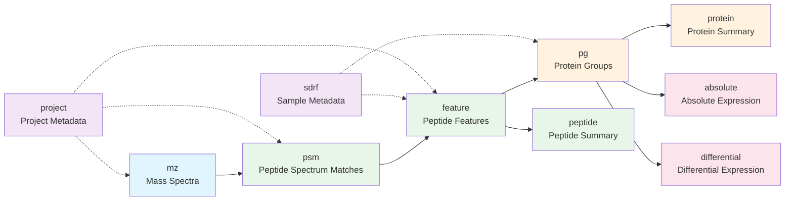

# QPX Format Overview

The **QPX format** is a modern, scalable data format designed specifically for proteomics data analysis. It addresses the limitations of existing formats -- XML-based HUPO-PSI standards (mzML, mzIdentML) and tab-delimited formats like mzTab -- which struggle with large-scale datasets and advanced analytical use cases such as AI/ML model development.

QPX organizes proteomics results into multiple **views**, each capturing a different aspect of the data (identifications, quantifications, spectra, metadata). Each view is serialized in the format best suited for its content: Apache Parquet for complex columnar data, TSV for expression matrices, and JSON for project metadata.

!!! note
    QPX does not aim to replace mzTab or individual tool output formats. Its goal is to provide a unified, performance-oriented format that enables AI-related use cases and easy integration of proteomics results across tools and platforms.

## Data model

The diagram below shows the QPX views and how they relate to each other. Arrows indicate data flow from raw spectra through identification and quantification to final expression results.

## Views at a glance

| View           | File class          | Format    | Description                                                                 |
| -------------- | ------------------- | --------- | --------------------------------------------------------------------------- |
| `mz`           | `mz_file`           | Parquet   | Raw and processed mass spectra (MS1 and MS2)                                |
| `psm`          | `psm_file`          | Parquet   | Peptide spectrum matches from database search engines (primarily DDA)       |
| `feature`      | `feature_file`      | Parquet   | Quantified peptide features per MS run, with sample and channel intensities |
| `pg`           | `pg_file`           | Parquet   | Protein groups with quantification across runs and channels                 |
| `peptide`      | `peptide_file`      | Parquet   | Peptide-level summary of quantification by sample                           |
| `protein`      | `protein_file`      | Parquet   | Protein-level summary of identification and quantification by sample        |
| `absolute`     | `absolute_file`     | TSV       | Absolute expression matrix (iBAQ values per protein per sample)             |
| `differential` | `differential_file` | TSV       | Differential expression results (fold changes, p-values between contrasts)  |
| `sdrf`         | `sdrf_file`         | TSV       | Sample and Data Relationship Format -- experimental metadata                |
| `project`      | --                  | JSON      | Project-level metadata, file manifest, and software provenance              |

!!! tip
    File extensions follow the pattern `*.{view}.{format}` -- for example, `PXD014414.feature.parquet` or `PXD014414.differential.tsv`.

## Which view do I need?

Use the decision guide below to find the right starting point for your use case.

| Use case                                          | Recommended view(s)                  |
| ------------------------------------------------- | ------------------------------------ |
| Train an ML model on PSM-level spectral features  | `psm` (with spectral arrays) + `mz` |
| Retrieve peptide intensities per sample            | `feature`                            |
| Build a volcano plot                               | `differential`                       |
| Compare protein abundance across conditions        | `absolute` or `pg`                   |
| Look up which proteins a peptide maps to           | `feature` or `psm`                   |
| Get a quick protein-level report for a web portal  | `protein`                            |
| Understand the experimental design                 | `sdrf`                               |
| List all files in a QPX project                    | `project`                            |

!!! note
    Some views are better suited for specific acquisition methods. The `psm` view is primarily intended for DDA experiments. The `feature` view covers both DDA and DIA workflows.

## Shared concepts

Several data structures are reused across multiple views. Each concept has its own page with full definitions and examples.

| Concept                                | Used in views                      | Description                                                        |
| -------------------------------------- | ---------------------------------- | ------------------------------------------------------------------ |
| [Peptidoform](peptidoform.md)          | PSM, Feature, Peptide              | Peptide sequence with modifications in ProForma notation           |
| [Modifications](modifications.md)      | PSM, Feature, Peptide              | Structured modification representation with localization scores    |
| [Intensities](intensities.md)          | Feature, Protein Group, Protein    | Primary and additional intensity measurements across channels      |
| [Scores & CV Terms](scores.md)         | PSM, Feature, Peptide, Protein Group | Search engine scores and controlled vocabulary parameters         |
| [Scan Numbers](scan.md)               | PSM, Feature, MZ                   | Instrument-specific scan identifiers and format conventions        |

## Current status

The QPX format is at **version 1.0**, primarily implemented in the [quantms workflow](https://github.com/bigbio/quantms). The format is open and can be adopted by any software tool. Versioning follows `{major}.{minor}` semantics: major releases may introduce breaking changes, while minor updates remain backward compatible. Every view file includes a `qpx_version` metadata field to identify which specification version produced it.
