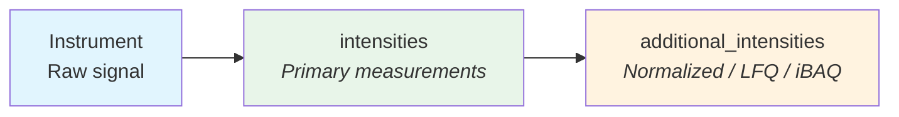

# Intensities

Intensity values in QPX are captured through two complementary fields: `intensities` for primary/raw measurements and `additional_intensities` for processed values produced by upstream tools. This separation enforces a clean boundary between **experimental design** (which channels and samples were measured) and **data processing** (values computed by the quantification tool, such as normalized intensities, LFQ, or iBAQ). QPX does not compute these values — it reads and stores them from the upstream tool's output.

## Semantic separation



| Field | Contains | Semantics |
| ----- | -------- | --------- |
| `intensities` | Raw intensity values from the instrument or quantification tool | Experimental design: channels, samples, raw measurements |
| `additional_intensities` | Normalized, LFQ, iBAQ, or other values pre-computed by the upstream tool | Data processing: values read from the tool's output, not computed by QPX |

This design means a data consumer can always find the raw measurement in `intensities` and any post-processed variants in `additional_intensities`, regardless of the tool that produced the file.

## Primary intensities

The `intensities` field is an array of structs. Each element represents one intensity measurement for a specific label within a single reference file.

### Struct definition

```text
intensities: array[struct{
    label:          string,  -- Label identifier (e.g. "LFQ", "TMT126", "iTRAQ114")
    intensity:      float    -- Raw intensity value
}]
```

### TMT example

In a TMT-10plex experiment, a single feature row contains one intensity per label -- each label maps to a different biological sample via the SDRF.

```json
[
  {"label": "TMT126",  "intensity": 15234.7},
  {"label": "TMT127N", "intensity": 18902.3},
  {"label": "TMT127C", "intensity": 12045.1},
  {"label": "TMT128N", "intensity": 22310.5},
  {"label": "TMT128C", "intensity": 9871.6}
]
```

### LFQ example

In a label-free quantification experiment, each feature row has a single intensity value. The label is set to `"LFQ"` by convention.

```json
[
  {"label": "LFQ", "intensity": 98765.4}
]
```

!!! note
    For LFQ experiments, each feature row corresponds to one MS run and one sample, so the `intensities` array always has a single element. For multiplexed experiments (TMT, iTRAQ), the array contains one element per label.

## Additional intensities

The `additional_intensities` field stores pre-computed values produced by upstream tools -- normalized intensities, LFQ values, iBAQ values, and so on. QPX reads these from the tool's output files (e.g., MaxQuant's `proteinGroups.txt`, DIA-NN's report) and stores them as-is. Each element mirrors the label structure of primary intensities but adds a nested array of named intensity types.

### Struct definition

```text
additional_intensities: array[struct{
    label:          string,  -- Matches the corresponding primary intensity entry
    intensities:      array[struct{
        intensity_name:  string,  -- Algorithm or metric name (e.g. "normalize_intensity")
        intensity_value: float    -- Value from upstream tool
    }]
}]
```

### Example

```json
[
  {
    "label": "LFQ",
    "intensities": [
      {"intensity_name": "normalize_intensity", "intensity_value": 0.1234},
      {"intensity_name": "lfq", "intensity_value": 23456.7},
      {"intensity_name": "ibaq", "intensity_value": 4567.8}
    ]
  },
  {
    "label": "LFQ",
    "intensities": [
      {"intensity_name": "normalize_intensity", "intensity_value": 0.1456},
      {"intensity_name": "lfq", "intensity_value": 25890.2},
      {"intensity_name": "ibaq", "intensity_value": 5102.3}
    ]
  }
]
```

!!! tip
    Common `intensity_name` values include `normalize_intensity`, `lfq`, `ibaq`, and `maxlfq`. Tool-specific names are acceptable when no standard name exists.

## When to use which field

| Scenario | Use `intensities` | Use `additional_intensities` |
| -------- | ------------------ | ---------------------------- |
| Raw reporter ion signal from TMT channels | Yes | -- |
| Single MS1 precursor intensity in LFQ | Yes | -- |
| Median-normalized intensity | -- | Yes |
| MaxLFQ protein intensity | -- | Yes |
| iBAQ value | -- | Yes |
| Algorithm-specific rescaled intensity | -- | Yes |

## Where intensities are used

| View                          | Primary intensity | `additional_intensities` | Notes |
| ----------------------------- | :---------------: | :----------------------: | ----- |
| Feature (`feature_file`)      | `intensities` (list) | Yes                   | Per-feature, per-run; one struct element per label |
| Protein Group (`pg_file`)     | `intensity` (scalar) | Yes                   | **Flattened since QPX 1.1**: one row per label, scalar `label` + `intensity` — no `intensities` list |
| Protein Summary (`protein_file`) | `abundance`       | --                       | Uses a single float per sample instead |

!!! warning "PG is flattened — no `intensities` list"
    The `intensities: list<{label, intensity}>` struct on this page describes the
    **feature** view. Since QPX 1.1 the protein-group view is **flattened**: each
    row carries scalar `label` + `intensity` columns and there is one row per
    `(anchor_protein, grouped_runs, label)`. `label`/`intensity` are null for
    identification-only groups. See [Protein Group](pg.md) and the
    [Data Model](data-model.md).

!!! note
    The Protein Summary view uses a simpler `abundance` field (a single float per sample) rather than the full intensities struct, since it serves as a lightweight report format.

## Further reading

- [Scores & CV Terms](scores.md) -- additional structured metadata for features and protein groups
- [QPX Format Overview](index.md) -- full list of views and concepts
