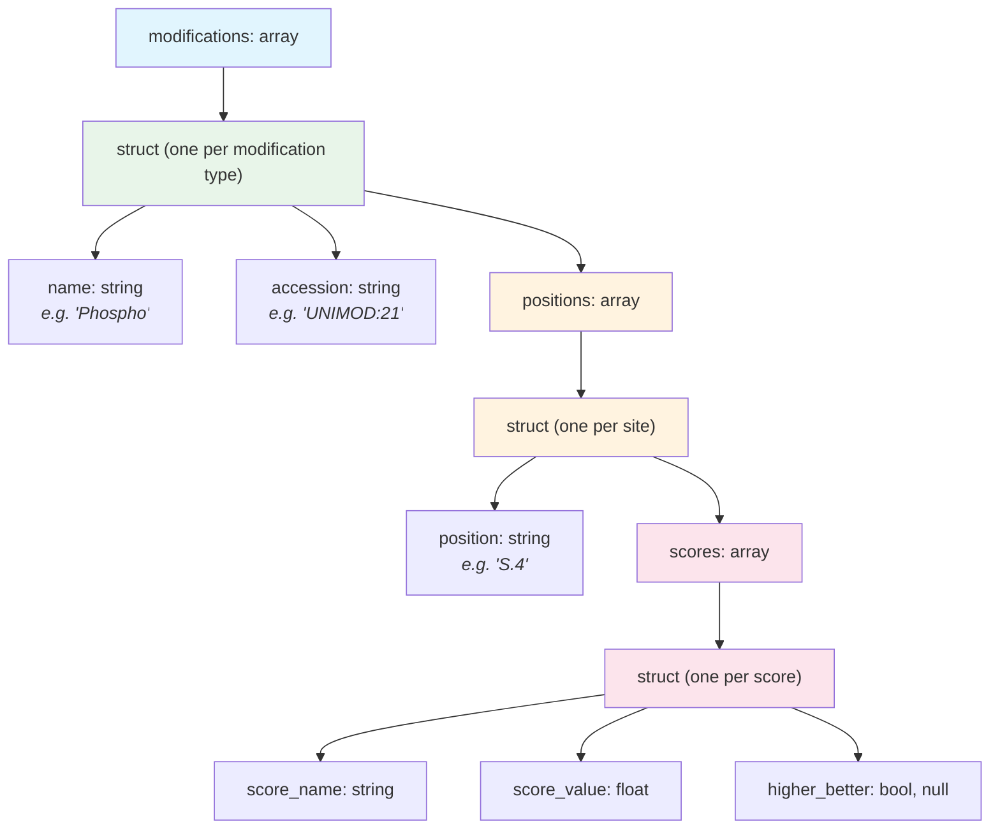

# Modifications

Modifications are chemical changes to a peptide sequence -- phosphorylation, oxidation, isobaric labels, and many others. In QPX, modifications are represented in two complementary ways:

1. **Inline** in the [peptidoform](peptidoform.md) string using ProForma notation
2. **Structured** in the `modifications` field as an array of nested records with position details and localization scores

The inline representation is compact and human-readable. The structured representation enables programmatic queries such as "find all phosphorylations with localization probability above 0.75."

## Inline representation

Modifications are written inside square brackets in the peptidoform string, immediately after the residue they modify.

```
PEPT[Phospho]IDM[Oxidation]K
```

Conventions for inline modification names:

| Convention | Example | When to use |
| ---------- | ------- | ----------- |
| UNIMOD accession (recommended) | `PEPT[UNIMOD:21]IDM[UNIMOD:35]K` | Always preferred -- accessions are unambiguous |
| Common name | `PEPT[Phospho]IDM[Oxidation]K` | Acceptable when UNIMOD accession exists |
| CHEMMOD mass shift | `PEPT[CHEMMOD:+79.9663]IDK` | For modifications without a UNIMOD entry; value in Daltons |

!!! tip
    Always prefer UNIMOD accessions over common names. Names can be ambiguous across tools, but accessions are globally unique.

## Structured representation

The `modifications` field is an `array[struct]` where each element describes one modification type applied to the peptide. The nested structure captures the modification identity, the positions where it occurs, and any associated localization scores.



### Struct definition

```
modifications: array[struct{
    name:      string,          -- Human-readable name (e.g. "Phospho")
    accession: string,          -- Ontology accession (e.g. "UNIMOD:21")
    positions: array[struct{
        position: string,       -- Site in the peptide (see position format below)
        scores:   array[struct{
            score_name:    string,     -- Score identifier (e.g. "localization_probability")
            score_value:   float,      -- Numeric score value
            higher_better: bool, null  -- Score direction; null if unknown
        }]
    }]
}]
```

## Position format rules

The `position` field uses a dot-separated format that encodes both the amino acid identity and its location in the sequence.

| Position type | Format | Example | Meaning |
| ------------- | ------ | ------- | ------- |
| Amino acid residue | `{AA}.{position}` (1-based) | `S.4` | Serine at position 4 |
| N-terminal | `N-term.0` | `N-term.0` | Modification on the peptide N-terminus |
| C-terminal | `C-term.{length+1}` | `C-term.9` | Modification on the C-terminus of an 8-residue peptide |

!!! warning
    Positions are **1-based** for amino acid residues. The N-terminal position is always `0`, and the C-terminal position is always `length + 1`, where `length` is the number of amino acids in the bare sequence.

## Localization scores

Each position can carry one or more scores that describe the confidence in placing the modification at that particular site. The most common score is `localization_probability`, which ranges from 0.0 to 1.0.

- **localization_probability**: The probability that this modification is correctly assigned to this specific residue. A value of 0.99 means 99% confidence.
- **higher_better**: Indicates score direction. For localization probability, this is `true` (higher is better).

Multiple scores can be attached to a single position -- for example, both a localization probability and a tool-specific confidence metric.

## Complete example

Consider the peptide `PEPTSDMK` with a phosphorylation on Ser at position 5 (high confidence) and an oxidation on Met at position 7.

**Peptidoform string:**

```
PEPTS[Phospho]DM[Oxidation]K
```

**Structured `modifications` field (JSON):**

```json
[
  {
    "name": "Phospho",
    "accession": "UNIMOD:21",
    "positions": [
      {
        "position": "S.5",
        "scores": [
          {
            "score_name": "localization_probability",
            "score_value": 0.97,
            "higher_better": true
          }
        ]
      }
    ]
  },
  {
    "name": "Oxidation",
    "accession": "UNIMOD:35",
    "positions": [
      {
        "position": "M.7",
        "scores": [
          {
            "score_name": "localization_probability",
            "score_value": 0.99,
            "higher_better": true
          }
        ]
      }
    ]
  }
]
```

!!! note
    The `modifications` field is nullable at the record level. If a peptide has no modifications, the field value is `null` rather than an empty array.

## Where modifications are used

The `modifications` field is available in the following QPX views:

| View                     | Field name       | Notes                                               |
| ------------------------ | ---------------- | --------------------------------------------------- |
| PSM (`psm_file`)         | `modifications`  | Per-PSM modification detail with localization scores |
| Feature (`feature_file`) | `modifications`  | Carried forward from best PSM or identification      |
| Peptide (`peptide_file`) | `modifications`  | Summarized at the peptide level                      |

## Further reading

- [Peptidoform](peptidoform.md) -- the inline ProForma representation
- [Scores & CV Terms](scores.md) -- how scores are structured across QPX
- [QPX Format Overview](index.md) -- full list of views and concepts
