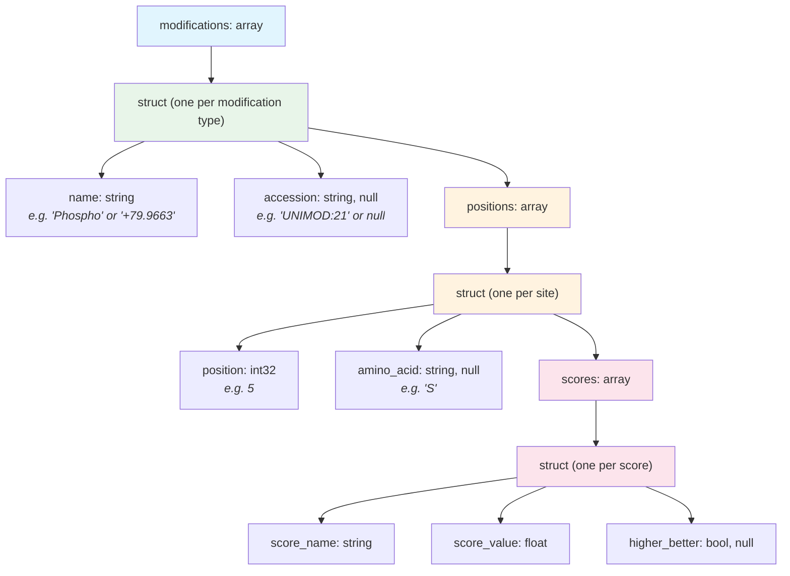

# Modifications

Modifications are chemical changes to a peptide sequence -- phosphorylation, oxidation, isobaric labels, and many others. In QPX, modifications are represented in two complementary ways:

1. **Inline** in the [peptidoform](peptidoform.md) string using ProForma notation
2. **Structured** in the `modifications` field as an array of nested records with position details and localization scores

The inline representation is compact and human-readable. The structured representation enables programmatic queries such as "find all phosphorylations with localization probability above 0.75."

## Inline representation

Modifications are written inside square brackets in the peptidoform string, immediately after the residue they modify.

```text
PEPT[Phospho]IDM[Oxidation]K
```

Conventions for inline modification names:

| Convention | Example | When to use |
| ---------- | ------- | ----------- |
| UNIMOD accession (recommended) | `PEPT[UNIMOD:21]IDM[UNIMOD:35]K` | Always preferred -- accessions are unambiguous |
| Common name | `PEPT[Phospho]IDM[Oxidation]K` | Acceptable when UNIMOD accession exists |
| Mass shift (unknown PTMs) | `PEPT[+79.9663]IDK` | For modifications without a UNIMOD entry; value in Daltons with sign |

!!! tip
    Always prefer UNIMOD accessions over common names. Names can be ambiguous across tools, but accessions are globally unique.

!!! note "Unknown modifications"
    When a modification cannot be mapped to a UNIMOD or other ontology entry, the ProForma notation uses the mass delta with sign directly (e.g., `[+79.9663]` or `[-17.027]`). In the structured representation, the `name` field carries the mass with sign (e.g., `"+79.9663"`) and the `accession` field is `null`.

## Structured representation

The `modifications` field is an `array[struct]` where each element describes one modification type applied to the peptide. The nested structure captures the modification identity, the positions where it occurs, and any associated localization scores.



### Struct definition

```text
modifications: array[struct{
    name:      string,          -- Human-readable name (e.g. "Phospho") or mass with sign (e.g. "+79.9663")
    accession: string, null,    -- Ontology accession (e.g. "UNIMOD:21"); null for unknown modifications
    positions: array[struct{
        position:   int32,      -- Numeric position in the peptide (see position format below)
        amino_acid: string, null, -- Single-letter amino acid code; null for terminal modifications
        scores:     array[struct{
            score_name:    string,     -- Score identifier (e.g. "localization_probability")
            score_value:   float,      -- Numeric score value
            higher_better: bool, null  -- Score direction; null if unknown
        }]
    }]
}]
```

## Position format rules

Each modification site is described by two fields:

- **`position`** (`int32`) -- The numeric position in the peptide sequence
- **`amino_acid`** (`string`, nullable) -- The single-letter amino acid code at that position, or `null` for terminal modifications

| Position type | `position` | `amino_acid` | Meaning |
| ------------- | ---------- | ------------ | ------- |
| Amino acid residue | 1-based index (e.g. `5`) | Single-letter code (e.g. `"S"`) | Serine at position 5 |
| N-terminal | `0` | `null` | Modification on the peptide N-terminus |
| C-terminal | `length + 1` (e.g. `9`) | `null` | Modification on the C-terminus of an 8-residue peptide |

!!! warning
    Positions are **1-based** for amino acid residues. The N-terminal position is always `0`, and the C-terminal position is always `length + 1`, where `length` is the number of amino acids in the bare sequence.

!!! note "Relationship to searched modifications"
    The `modifications` struct described here is for **per-PSM/feature reporting** -- it records which modifications were actually observed in a specific peptide identification, with localization scores. For the list of modifications configured in the search engine, see the `modification_parameters` field in [run.parquet](run.md), which uses the [MODIFICATION](run.md#modification-structure) structure.

## Localization scores

Each position can carry one or more scores that describe the confidence in placing the modification at that particular site. The most common score is `localization_probability`, which ranges from 0.0 to 1.0.

- **localization_probability**: The probability that this modification is correctly assigned to this specific residue. A value of 0.99 means 99% confidence.
- **higher_better**: Indicates score direction. For localization probability, this is `true` (higher is better).

Multiple scores can be attached to a single position -- for example, both a localization probability and a tool-specific confidence metric.

## Complete example

Consider the peptide `PEPTSDMK` with a phosphorylation on Ser at position 5 (high confidence) and an oxidation on Met at position 7.

**Peptidoform string:**

```text
PEPTS[Phospho]DM[Oxidation]K
```

**Structured `modifications` field (JSON):**

```json
[
  {
    "name": "Phospho",
    "accession": "UNIMOD:21",
    "positions": [
      {
        "position": 5,
        "amino_acid": "S",
        "scores": [
          {
            "score_name": "localization_probability",
            "score_value": 0.97,
            "higher_better": true
          }
        ]
      }
    ]
  },
  {
    "name": "Oxidation",
    "accession": "UNIMOD:35",
    "positions": [
      {
        "position": 7,
        "amino_acid": "M",
        "scores": [
          {
            "score_name": "localization_probability",
            "score_value": 0.99,
            "higher_better": true
          }
        ]
      }
    ]
  }
]
```

### N-terminal modification example

An N-terminal acetylation on the peptide `VLHPLEGAVVIIFK`:

```json
{
  "name": "Acetyl",
  "accession": "UNIMOD:1",
  "positions": [
    {
      "position": 0,
      "amino_acid": null,
      "scores": null
    }
  ]
}
```

### Unknown modification example

A mass shift of +42.011 Da on Lys at position 3, where no UNIMOD accession is known. The peptidoform would be `PEK[+42.011]TIDE`:

```json
{
  "name": "+42.011",
  "accession": null,
  "positions": [
    {
      "position": 3,
      "amino_acid": "K",
      "scores": null
    }
  ]
}
```

!!! note
    The `modifications` field is nullable at the record level. If a peptide has no modifications, the field value is `null` rather than an empty array.

## Where modifications are used

The `modifications` field is available in the following QPX views:

| View                     | Field name       | Notes                                               |
| ------------------------ | ---------------- | --------------------------------------------------- |
| PSM (`psm_file`)         | `modifications`  | Per-PSM modification detail with localization scores |
| Feature (`feature_file`) | `modifications`  | Carried forward from best PSM or identification      |
| Peptide (`peptide_file`) | `modifications`  | Summarized at the peptide level                      |

## Further reading

- [Peptidoform](peptidoform.md) -- the inline ProForma representation
- [Scores & CV Terms](scores.md) -- how scores are structured across QPX
- [QPX Format Overview](index.md) -- full list of views and concepts
