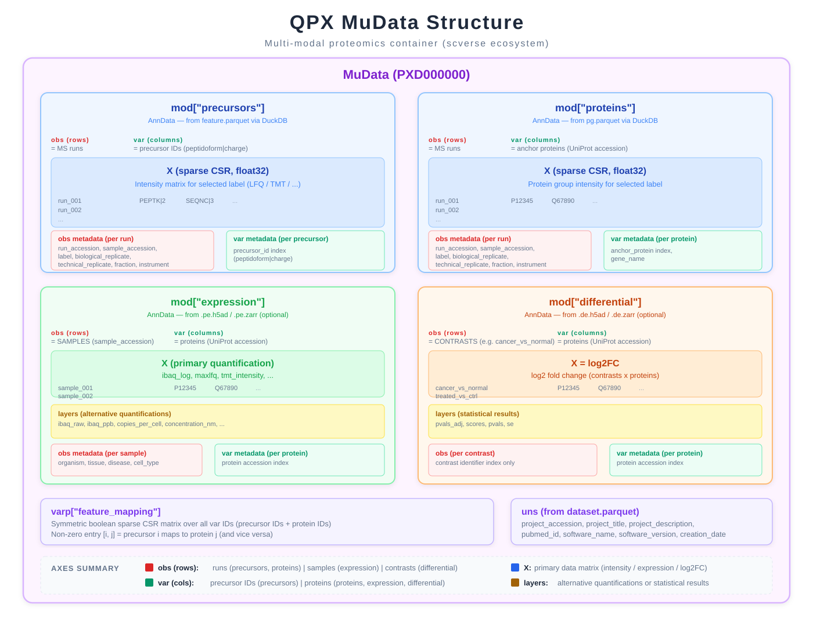

# MuData Export

QPX datasets can be exported to [MuData](https://mudata.readthedocs.io/) objects for multi-modal analysis within the [scverse](https://scverse.org/) ecosystem. This is a **one-directional export** -- QPX Parquet files are the source of truth; MuData is a convenience view for downstream analysis.

## Use cases

- Combine precursor-level, protein-level, expression, and differential data in a single in-memory object.
- Use muon, scanpy, and other scverse tools for visualization and analysis.
- Share proteomics results in a format familiar to the single-cell and multi-omics community.
- Perform cross-modality queries (e.g., link precursors to their anchor proteins).

## Installation

MuData export requires the optional `mudata` dependency:

```bash
pip install 'qpx[mudata]'
```

## Usage

### Basic export

```python
from qpx import QpxDataset

ds = QpxDataset("PXD000000.qpx")

# Export all available modalities
mdata = ds.to_mudata()
print(mdata)
# MuData object with 4 modalities
#   precursors:   120 x 8432
#   proteins:     120 x 2156
#   expression:   24 x 2156
#   differential: 3 x 2156
```

### Selecting an intensity label

```python
# Use a specific intensity column for the X matrix
mdata = ds.to_mudata(intensity_label="intensity_apex")
```

### Filtering modalities

```python
# Export only precursor and protein modalities
mdata = ds.to_mudata(modalities=["precursors", "proteins"])
```

### Serialization

```python
# Save to disk (HDF5-backed)
mdata.write("PXD000000.h5mu")

# Read back
import mudata as mu
mdata = mu.read("PXD000000.h5mu")
```

## MuData structure overview

```
MuData
  mod["precursors"]    AnnData  (runs x peptidoform|charge)     Core
  mod["proteins"]      AnnData  (runs x anchor_protein)         Core
  mod["expression"]    AnnData  (samples x proteins)            Optional
  mod["differential"]  AnnData  (contrasts x proteins)          Optional
  varp["feature_mapping"]       CSR sparse boolean matrix
  uns                           Dataset-level metadata
```



## Modality details

### precursors (core)

Precursor-level quantification across MS runs.

| Slot | Content | Description |
|------|---------|-------------|
| `obs` | Run metadata | One row per MS run (reference_file_name, condition, ...) |
| `var` | Precursor identity | Index = `peptidoform\|charge` (ProForma + charge state) |
| `X` | Intensity matrix | Precursor intensity per run (runs x precursors) |

### proteins (core)

Protein-level quantification across MS runs.

| Slot | Content | Description |
|------|---------|-------------|
| `obs` | Run metadata | One row per MS run (same obs as precursors) |
| `var` | Protein identity | Index = `anchor_protein` (UniProt accession); includes `gene_name` |
| `X` | Intensity matrix | Protein intensity per run (runs x proteins) |

### expression (optional)

Sample-level protein quantification. Present only when `*.pe.h5ad` or `*.pe.zarr` files exist in the dataset.

| Slot | Content | Description |
|------|---------|-------------|
| `obs` | Sample metadata | One row per biological sample (organism, tissue, disease, ...) |
| `var` | Protein identity | Index = protein accession; includes `gene_name` |
| `X` | Primary quantification | e.g., `ibaq_log`, MaxLFQ, TMT intensity |
| `layers` | Alternatives | `ibaq_raw`, `ibaq_ppb`, `copies_per_cell`, etc. |
| `uns` | File metadata | `qpx_version`, `project_accession`, `file_type`, etc. |

See [Protein Expression](protein_expression.md) for the full schema.

### differential (optional)

Statistical results comparing protein abundance between conditions. Present only when `*.de.h5ad` or `*.de.zarr` files exist in the dataset.

| Slot | Content | Description |
|------|---------|-------------|
| `obs` | Contrast metadata | One row per contrast (condition_test, condition_reference) |
| `var` | Protein identity | Index = protein accession; includes `gene_name` |
| `X` | Log2 fold change | Primary matrix of log2FC values (contrasts x proteins) |
| `layers["pvals_adj"]` | Adjusted p-values | BH-corrected p-values |
| `layers["scores"]` | Test statistics | t-values or equivalent |
| `layers["pvals"]` | Raw p-values | Uncorrected p-values |
| `layers["se"]` | Standard errors | Standard error of log2FC |

See [Differential Expression](differential.md) for the full schema.

## Cross-modality mapping

The `varp["feature_mapping"]` slot stores a symmetric boolean sparse matrix (CSR format) that links variables across modalities. This enables queries such as "which precursors map to protein P04637?".

```python
import numpy as np

# Get the feature mapping
mapping = mdata.varp["feature_mapping"]

# Find precursors for a specific protein
protein_idx = mdata.mod["proteins"].var.index.get_loc("P04637")
precursor_mask = mapping[protein_idx, :].toarray().flatten().astype(bool)
linked_precursors = mdata.mod["precursors"].var.index[precursor_mask]
```

!!! note "Mapping semantics"
    The feature mapping is derived from the QPX peptide-protein map (`pepmap.parquet`). Each non-zero entry indicates that a precursor (peptidoform|charge) is associated with a protein.

## File naming

MuData is an in-memory export and does not define a new QPX file extension. However, the source AnnData files follow QPX conventions:

| File type | Extension | Example |
|-----------|-----------|---------|
| Protein Expression | `.pe.h5ad` or `.pe.zarr` | `PXD000000.pe.h5ad` |
| Differential Expression | `.de.h5ad` or `.de.zarr` | `PXD000000.de.h5ad` |
| Serialized MuData | `.h5mu` | `PXD000000.h5mu` |

## Notes

!!! warning "One-directional export"
    MuData export is read-only. Modifications to the MuData object are **not** written back to the QPX Parquet files. Always treat the QPX dataset as the source of truth.

!!! tip "muon compatibility"
    The exported MuData object is fully compatible with [muon](https://muon-tutorials.readthedocs.io/) for multi-modal analysis, plotting, and integration workflows. Use `mu.pl.embedding()`, `mu.pp.intersect_obs()`, and other muon functions directly.

!!! note "Future extensions"
    Planned modalities include PSM-level data and gene-level aggregation. The modular design of MuData makes it straightforward to add new modalities without breaking existing code.
