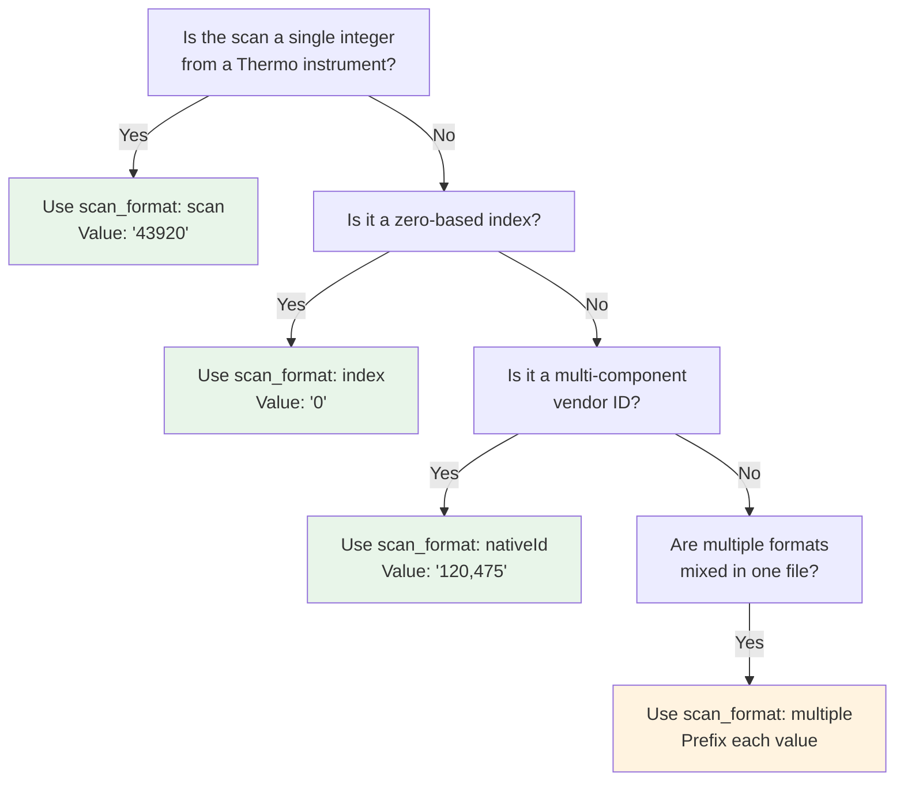

# Scan Numbers

The `scan` field in QPX identifies a specific MS/MS spectrum within a raw or converted spectra file. Because different mass spectrometer vendors use different internal identifiers, QPX defines a consistent encoding convention based on the HUPO-PSI USI (Universal Spectrum Identifier) standard.

A scan value is always stored as a **string**, even when it is a simple integer. This accommodates instruments that require compound identifiers with multiple components.

## Instrument-specific formats

Each instrument vendor uses a different native identifier structure. QPX collapses these into a comma-separated string representation.

### Thermo

Thermo instruments use `controllerType`, `controllerNumber`, and `scan` components. Since `controllerType=0` and `controllerNumber=1` are the defaults for mass spectra, only the scan number is stored.

| Native ID | QPX `scan` value |
| --------- | ---------------- |
| `controllerType=0 controllerNumber=1 scan=43920` | `"43920"` |

!!! note
    In rare cases where `controllerType` is not 0 or `controllerNumber` is not 1 (e.g., referencing a PDA spectrum), the full nativeId form must be used: `controllerType=5 controllerNumber=1 scan=7` becomes `"5,1,7"`.

### Bruker

Bruker TIMS instruments use a two-component identifier combining frame and scan.

| Native ID | QPX `scan` value |
| --------- | ---------------- |
| `frame=120 scan=475` | `"120,475"` |

### Waters

Waters instruments use a three-component identifier: function, process, and scan.

| Native ID | QPX `scan` value |
| --------- | ---------------- |
| `function=10 process=1 scan=345` | `"10,1,345"` |

### AB Sciex

AB Sciex instruments use a four-component identifier: sample, period, cycle, and experiment.

| Native ID | QPX `scan` value |
| --------- | ---------------- |
| `sample=1 period=1 cycle=2740 experiment=10` | `"1,1,2740,10"` |

## The scan_format metadata field

Because the `scan` column alone does not tell a reader how to interpret the string, QPX files include a `scan_format` metadata field in the Parquet file footer. This field declares the format used throughout the file.

| `scan_format` value | Meaning | Example scan value |
| ------------------- | ------- | ------------------ |
| `scan` | Simple Thermo-style scan number | `"43920"` |
| `index` | Zero-based spectrum index in the file | `"0"`, `"1"`, `"2"` |
| `nativeId` | Multi-component native identifier (Bruker, Waters, AB Sciex) | `"120,475"` |
| `multiple` | Mixed formats within the same file (see below) | `"scan:43920"`, `"nativeId:120,475"` |

### The `multiple` format

When multiple experiments are merged into a single file (e.g., combining data from different instruments or runs with different scan conventions), each scan value must be prefixed with its format type.

```
scan:43920
nativeId:1,1,2740,10
index:0
nativeId:120,475
```

!!! warning
    The `multiple` format should only be used when merging heterogeneous scan formats into one file. In normal single-instrument workflows, prefer `scan`, `index`, or `nativeId` without prefixes.

## When to use nativeId vs scan



## Where scan is used

The `scan` field appears in the following QPX views:

| View | Field name | Notes |
| ---- | ---------- | ----- |
| PSM (`psm_file`) | `scan` | Scan of the identified MS/MS spectrum |
| Feature (`feature_file`) | `scan` | Scan of the best PSM that identified the feature (nullable) |
| MZ (`mz_file`) | `id` | The spectrum identifier (uses the same encoding conventions) |

!!! tip
    The `scan` value in the Feature view refers to the best PSM that identified the feature. The reference file for that scan is recorded in `scan_reference_file_name`, which may differ from the feature's own `reference_file_name`.

## File metadata example

The `scan_format` is stored in the Parquet file metadata alongside other QPX metadata fields.

```python
import pyarrow.parquet as pq

file_metadata = {
    "qpx_version": "1.0",
    "scan_format": "scan",
    "file_type": "psm_file",
    "software_provider": "quantms 1.3.0",
    "project_accession": "PXD012345",
    "creation_date": "2024-06-15",
    "uuid": "943a8f02-0527-4528-b1a3-b96de99ebe75"
}

# Write the Parquet file with metadata
pq.write_table(table, "output.psm.parquet", metadata=file_metadata)
```

## Further reading

- [Scores & CV Terms](scores.md) -- additional metadata attached to PSMs and features
- [QPX Format Overview](index.md) -- full list of views and concepts
