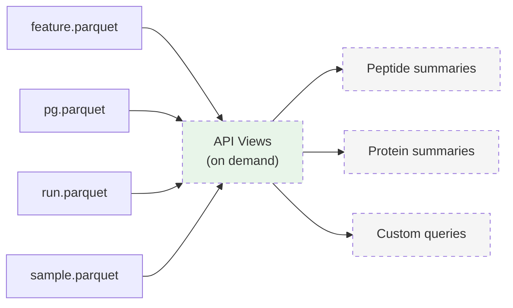

# API Views

API views are **not** stored as standalone Parquet files. They are derived, on-demand views that the API computes at query time by joining and aggregating the primary data views (`psm.parquet`, `feature.parquet`, `pg.parquet`) with the metadata views (`run.parquet`, `sample.parquet`).

!!! info "Programmable, not prescriptive"
    Unlike the primary data views which have fixed YAML schemas, API views are **programmable**. The API can expose different fields, aggregations, and summaries depending on the use case. There is no rigid response schema -- what you retrieve is determined by your query.

## Concept

The QPX primary views (PSM, Feature, Protein Group) store the full, detailed data. API views sit on top of these and provide **convenience summaries** tailored to specific needs:

- A **peptide-level summary** might aggregate features across runs into one abundance value per peptide per sample.
- A **protein-level summary** might roll up protein group data into protein counts, abundances, and identification metrics per sample.
- A **custom view** might combine fields from multiple primary views to answer a specific question.

The key insight is that the primary data model is rich enough to derive many different summaries. Rather than defining a fixed schema for each possible summary, the API allows users to request exactly the data they need.

## Examples of what you can retrieve

Because views are programmable, different users can request different slices of the data:

| Use case | What you might request |
|----------|----------------------|
| Quick protein report | Protein accessions, gene names, number of peptides per protein |
| Abundance comparison | Protein accessions, abundance per sample, global q-values |
| Peptide coverage | Peptide sequences, modifications, which proteins they map to |
| Identification summary | Number of proteins, number of peptides, number of PSMs per sample |
| Sample overview | Per-sample counts and total intensities |

## How views are derived

API views are computed by joining and aggregating the primary QPX data. For example:

**Protein-level data** can be derived from the PG view by:

1. Joining `pg.parquet` with `run.parquet` to resolve sample-channel mappings.
2. Selecting the `anchor_protein` as the representative for each protein group.
3. Extracting intensity values per sample from `intensities`.
4. Optionally aggregating peptide/PSM counts, scores, or gene annotations.

```sql
-- Example: deriving protein abundance per sample from pg + run
SELECT pg.anchor_protein AS protein_accession,
       rs.sample_accession,
       i.intensity AS abundance,
       pg.global_qvalue,
       pg.gg_names
FROM 'PXD014414.pg.parquet' pg,
     'PXD014414.run.parquet' r,
     UNNEST(r.samples) AS rs,
     UNNEST(pg.intensities) AS i
WHERE list_contains(pg.grouped_runs, r.run_file_name)
  AND i.label = rs.label;
```

**Peptide-level data** can be derived from the Feature view by:

1. Joining `feature.parquet` with `run.parquet` to resolve sample-channel mappings.
2. Aggregating features across files and channels into a single abundance per sample.
3. Optionally joining with `pg.parquet` for gene annotations.

```sql
-- Example: deriving peptide abundance per sample from feature + run
SELECT f.sequence,
       f.peptidoform,
       rs.sample_accession,
       i.intensity AS abundance,
       pg.gg_names
FROM 'PXD014414.feature.parquet' f,
     'PXD014414.run.parquet' r,
     UNNEST(r.samples) AS rs,
     UNNEST(f.intensities) AS i,
     'PXD014414.pg.parquet' pg
WHERE f.run_file_name = r.run_file_name
  AND i.label = rs.label
  AND f.anchor_protein = pg.anchor_protein
  AND list_contains(pg.grouped_runs, f.run_file_name);
```

## Relationship to primary views



!!! tip "Use primary views for full detail"
    API views are for convenience and fast lookups. For full detail -- per-file intensities, scan references, protein group inference context, spectral data -- always use the primary views directly: [PSM](psm.md), [Feature](feature.md), [Protein Group](pg.md), [Mass Spectra](mz.md).

## Built-in API Views

The Python API provides several pre-built views accessible as properties on the `Dataset` object:

| View | Property | Data Method | Description |
|------|----------|-------------|-------------|
| Identification Summary | `ds.identification_summary` | `.summary()` | Per-run protein, peptide, and feature counts |
| Run Summary | `ds.run_summary` | `.summary()` | Per-run statistics (cached) |
| Modification View | `ds.modification_view` | `.frequency()` | Modification frequency across PSMs |
| QC View | `ds.qc_view` | `.metrics()` | Dataset-wide quality control metrics |
| Protein View | `ds.protein_view` | `.abundance()` | Protein abundance per sample (joins PG + Run) |
| Peptide View | `ds.peptide_view` | `.abundance()` | Peptide abundance per sample (joins Feature + Run) |

### Plotting

Each summary view has a `.plot()` method that returns a `matplotlib.Figure` for quick visualization. Matplotlib is imported lazily -- it is only required when `.plot()` is called.

```python
import qpx

ds = qpx.open_dataset("PXD014414/")

# Identification summary bar chart
fig = ds.identification_summary.plot()
fig.savefig("identifications.png")

# Run summary grouped bar chart
fig = ds.run_summary.plot(figsize=(14, 7))
fig.savefig("run_summary.png")

# QC metrics overview
fig = ds.qc_view.plot()
fig.savefig("qc_overview.png")

# Modification frequency (top 20 by PSM count)
fig = ds.modification_view.plot(top_n=20)
fig.savefig("modifications.png")
```

!!! tip "Customization"
    Each `.plot()` method accepts a `figsize` tuple. The `ModificationView.plot()` also accepts `top_n` to control how many modifications are shown. For more advanced customization, retrieve the data with `.summary().to_df()` and build your own plots.

## Dataset Collections

For multi-dataset analysis, `DatasetCollection` registers multiple datasets in a single DuckDB engine. Each structure is indexed by dataset number (e.g., `feature_0`, `feature_1`).

### Virtual Mode (Cross-Dataset SQL)

```python
import qpx

ds1 = qpx.open_dataset("PXD014414/")
ds2 = qpx.open_dataset("PXD016999/")

coll = qpx.DatasetCollection([ds1, ds2])

# Query across datasets using indexed table names
result = coll.sql("""
    SELECT 'PXD014414' AS dataset, COUNT(*) AS n_features FROM feature_0
    UNION ALL
    SELECT 'PXD016999' AS dataset, COUNT(*) AS n_features FROM feature_1
""")
print(result.to_df())

# See what structures are available per dataset
print(coll.structure_names)
# {0: ['feature', 'pg', 'sample', 'run', 'dataset'], 1: ['feature', 'pg', ...]}
```

### Physical Merge

Merge matching structures from multiple datasets into a new directory. A `source_dataset` column is added to distinguish origins.

```python
coll.merge("merged_output/", structures=["feature", "pg"])

# Open the merged dataset
merged = qpx.open_dataset("merged_output/")
df = merged.feature.to_df()
print(df["source_dataset"].value_counts())
```

!!! note "Common structures only"
    When no `structures` argument is passed to `merge()`, only structures present in **all** datasets are merged.
